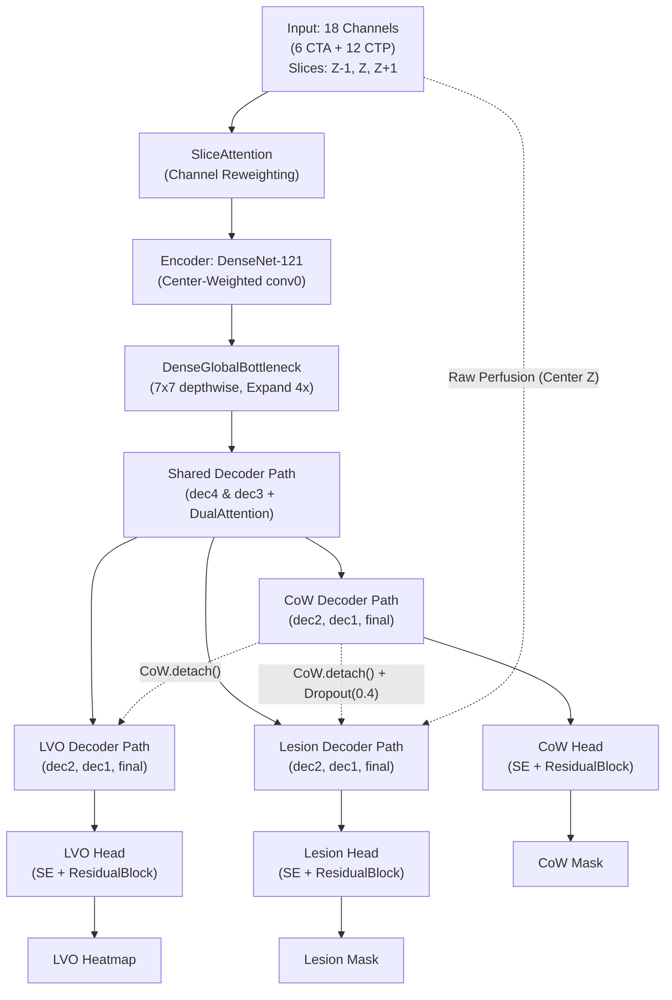

# ISLES'24: Technical Whitepaper - Single-Encoder Multi-Task 2.5D UNet (SOTA Architecture)

Tài liệu này đặc tả toàn bộ kiến trúc mô hình, hệ thống hàm mất mát (Loss) và chiến lược huấn luyện đa nhiệm (Multi-Task Learning) thực tế đang được áp dụng trong codebase dành cho bài toán phân vùng đột quỵ (ISLES 2024).

---

## 1. Tổng Quan Kiến Trúc (Architecture Overview)

Kiến trúc chính là **Single-Encoder Triple-Decoder UNet** với cơ chế rẽ nhánh sâu tuần tự (**Knowledge Cascade**) và tích hợp tưới máu trực tiếp (**Raw Perfusion Injection**). Mô hình thực hiện Early Fusion 18 kênh đầu vào trên một Encoder duy nhất, sau đó phân tách thành 3 nhánh Decoder độc lập ở độ phân giải cao.

### 1.1. Backbone (Encoder) & Input Processing
*   **SliceAttention:** Khối Attention dạng Squeeze-and-Excitation cải tiến (`AvgPool` + `MaxPool` concat qua MLP) nằm ngay trước `conv0` nhằm giúp mô hình tự động gán trọng số ưu tiên cho các kênh/modality quan trọng đầu vào.
*   **Input Inflation (Center-Weighted):** Lớp `conv0` của DenseNet-121 (gốc 3 kênh) được nhân bản lên **18 kênh** (6 kênh CTA + 12 kênh CTP) sử dụng bộ lọc trọng số ưu tiên tâm: lát cắt trung tâm $Z$ được nhân với hệ số `1.0`, các lát lân cận $Z-1, Z+1$ nhân với `0.4`, sau đó chuẩn hóa năng lượng bảo toàn phương sai.
*   **Backbone:** DenseNet-121 tải trọng số y học **RadImageNet** giúp tăng tốc hội tụ nhờ khả năng trích xuất đặc trưng y tế mạnh mẽ.

### 1.2. Shared & Specialized Decoders
Để tối ưu hóa dung lượng VRAM và tối đa hóa khả năng chia sẻ đặc trưng, mô hình sử dụng cấu trúc **Decoupled Specialist v4**:
*   **Shared Bottleneck:** Một lớp 1x1 Conv giảm chiều dữ liệu kết hợp **DenseGlobalBottleneck** (khối đảo ngược mở rộng 4x sử dụng 7x7 depthwise conv lấy cảm hứng từ ConvNeXt) giúp đạt receptive field bao phủ toàn bộ vùng đặc trưng đáy.
*   **Shared Decoder Path (dec4, dec3):** Cát nghĩa không gian chung ở độ phân giải thấp ($16\times16$ và $32\times32$) cho cả 3 nhiệm vụ. Mỗi khối nâng độ phân giải sử dụng **Lightweight Dual Attention** (CBAM-style: SE channel attention kết hợp với 7x7 spatial conv).
*   **Task-Specific Decoder Paths (dec2, dec1, final):** Phân tách thành 3 đường giải mã hoàn toàn độc lập ở độ phân giải cao ($64\times64$, $128\times128$, $256\times256$) để phục vụ riêng cho các mục tiêu giải phẫu và bệnh lý khác nhau.

### 1.3. Cơ Chế Kết Nối Nâng Cao
*   **Knowledge Cascade (Lan truyền tri thức):** 
    1. Nhánh **CoW** được giải mã trước để lấy thông tin giải phẫu hệ mạch.
    2. Nhánh **LVO** nhận đặc trưng dẫn đường từ CoW (`CoW.detach()`) qua khối **FusedSpatialAttention** để thu hẹp vùng tìm kiếm điểm tắc mạch lớn.
    3. Nhánh **Lesion** nhận đặc trưng dẫn đường từ CoW (`CoW.detach()`) kết hợp `Dropout2d(p=0.4)` để tránh hiện tượng quá phụ thuộc vào mạch máu mà bỏ qua vùng nhu mô.
    *(Việc sử dụng `.detach()` giúp cô lập hoàn toàn gradient giữa các TaskPath, ngăn ngừa nhiễu gradient chéo)*.
*   **Raw Perfusion Injection:** Nhánh **Lesion** được bơm trực tiếp các bản đồ tưới máu thô của lát cắt trung tâm $Z$ (đã qua pooling tương thích kích thước) vào skip-connection của `dec2` và `dec1`. Điều này giúp giữ lại các tín hiệu huyết động học nguyên bản vốn dễ bị suy giảm khi đi qua Encoder sâu.
*   **Deep Supervision & Prev-Mask Propagation:** Ở các tầng `dec2` và `dec1`, mô hình có các `AuxHead` dự đoán sớm. Dự đoán của tầng sâu được nâng kích thước và gom (concatenate) trực tiếp vào đầu vào tầng nông hơn làm tín hiệu dẫn đường lặp (iterative refinement). Nhánh LVO sử dụng nội suy `nearest` cho mặt nạ bổ trợ để bảo toàn độ sắc nét của mục tiêu nhỏ dạng điểm.

### 1.4. Task-Specific Segmentation Heads
Mỗi nhánh ra mặt nạ được thiết kế dưới dạng: `ChannelAttention(reduction=4) -> ResidualBlock(2x Conv3x3) -> Dropout2d -> Conv1x1`.
*   **Bias Initialization:** Khởi tạo bias đặc thù để giải quyết mất cân bằng lớp cực đoan:
    *   LVO Head: `bias = -2.0` (Aux Head dùng `bias = -4.595`)
    *   CoW & Lesion Head: `bias = -2.944`

---

## 2. Hệ Thống Hàm Mất Mát (Task-Specific Losses)

Do tính chất hình học và phân phối nhãn rất khác biệt, mỗi nhánh sử dụng một tổ hợp Loss chuyên biệt phối hợp cùng Deep Supervision (trọng số 0.5 cho aux loss).

| Nhiệm vụ | Công thức Loss | Rationale (Lý do thiết kế) |
| :--- | :--- | :--- |
| **Lesion** (Ổ nhồi máu) | `Focal Tversky (α=0.35, β=0.65, γ=1.35)`  + `SDF Boundary Loss (weight=0.45)` | Tính toán **per-sample** để tránh nổ gradient từ Batch-Dice khi dính False Positive diện rộng. `β=0.65` ưu tiên hạn chế False Negative (tăng recall). SDF (Signed Distance Function) Loss giúp bám sát các đường viền phức tạp của vùng nhồi máu. |
| **LVO** (Tắc mạch lớn) | `Modified Focal Loss (α=2.5, β=4.5)`  + `Gaussian Curriculum` | LVO chỉ xuất hiện dưới dạng một chấm vài pixel. **Gaussian Curriculum** tạo một vùng Gaussian xung quanh điểm tắc với kích thước $\sigma$ thu nhỏ dần theo Epoch ($\sigma = \max(5.0 \times 0.97^{epoch}, 1.25)$) để mô hình dễ "bắt trúng" ở giai đoạn đầu và hội tụ chính xác ở giai đoạn sau. |
| **CoW** (Vòng Willis) | `Tversky Loss (α=0.2, β=0.8)`  + `Soft CLDice Loss (weight=0.45)` | `β=0.8` phạt rất nặng hiện tượng đứt gãy mạch máu. **clDice (Centerline Dice)** sử dụng skeletonization mềm để duy trì tính liên tục và topology dạng mạng lưới của đa giác Willis. |

---

## 3. Cân Bằng Đa Nhiệm Động & Gradient Surgery

Để huấn luyện đồng thời 3 tác vụ mà không bị hiện tượng một tác vụ dễ lấn át tác vụ khó hoặc xung đột gradient, mô hình áp dụng hai cơ chế điều phối động:

### 3.1. PCGrad (Projecting Conflicting Gradients)
Ở mỗi bước lan truyền ngược:
1. Loss của từng tác vụ (Lesion, LVO, CoW) được `backward()` độc lập (trong ngữ cảnh `no_sync` của DDP).
2. Gradient của từng tác vụ được đồng bộ qua các GPU (`all_reduce`).
3. Nếu vector gradient của hai tác vụ có góc tù (xung đột hướng tối ưu), gradient của tác vụ này sẽ được chiếu vuông góc lên không gian không xung đột của tác vụ kia trước khi cộng tổng. Thứ tự chiếu được xáo ngẫu nhiên ở mỗi bước.

### 3.2. PGW (Performance Gap Weighting)
Bắt đầu từ Epoch 8, trọng số các tác vụ được cập nhật tự động dựa trên khoảng cách tới mục tiêu (Gap):
*   **Mục tiêu hiệu năng:** `Lesion_Dice = 0.75`, `LVO_D2C_F1 = 0.50`, `CoW_Dice = 0.88`.
*   **Cập nhật trọng số:** 
    $$\text{Gap}_t = \max(0, \text{Target}_t - \text{Metric}_t)$$
    $$\text{RawWeight}_t = \text{softmax}(\text{Gap}_t / \tau)$$
    $$\text{Weight}_t = m \cdot \text{Weight}_{t-1} + (1-m) \cdot \text{RawWeight}_t$$
*   Áp dụng các biên cứng `w_min` và `w_max` để tránh triệt tiêu hoàn toàn bất kỳ tác vụ nào.

---

## 4. Chiến Lược Tối Ưu Hóa (Optimization Protocol)

*   **Warm-up Curriculum:** Encoder được đóng băng (`frozen`) trong 11 Epoch đầu tiên để các Decoder Path tự khởi động và học cách dựng lại không gian. Từ Epoch 12, Encoder được mở băng và huấn luyện với tốc độ học nhỏ hơn (Differential LR tỷ lệ 20:1, tức `encoder_lr = 5e-5` so với `base_lr = 1e-3`).
*   **3-Phase Scheduler:** Kết hợp SequentialLR bao gồm: Warmup (5 Epoch) $\rightarrow$ Hold (7 Epoch) $\rightarrow$ Cosine Annealing (88 Epoch).
*   **Independent Checkpointing:** Lưu trữ 3 mô hình tốt nhất độc lập (`best_overall.pt`, `best_lesion.pt`, `best_lvo.pt`) dựa trên điểm số hỗn hợp (`0.45*Lesion + 0.45*LVO + 0.1*CoW`) và metric riêng lẻ của từng tác vụ.
*   **Modality Robustness:** Tích hợp `ModalityDropout` trong pipeline tăng cường dữ liệu (ngẫu nhiên tắt toàn bộ kênh CTA hoặc CTP với xác suất 10%) giúp mô hình có khả năng suy luận ổn định ngay cả khi thiếu khuyết modality lâm sàng.
