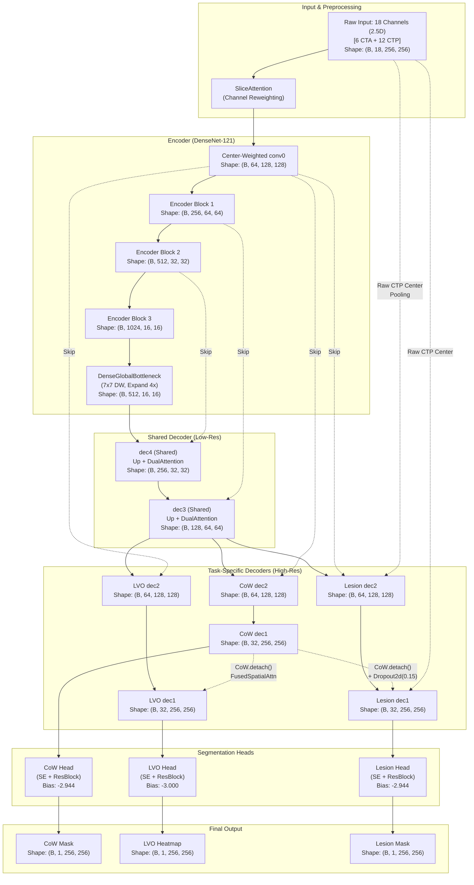

# ISLES'24: Technical Whitepaper - Single-Encoder Multi-Task 2.5D UNet (SOTA Architecture)

Tài liệu này đặc tả toàn bộ kiến trúc mô hình, hệ thống hàm mất mát (Loss) và chiến lược huấn luyện đa nhiệm (Multi-Task Learning) thực tế đang được áp dụng trong codebase dành cho bài toán phân vùng đột quỵ (ISLES 2024).

---

## 1. Tổng Quan Kiến Trúc (Architecture Overview)

Kiến trúc chính là **Single-Encoder Triple-Decoder UNet** với cơ chế rẽ nhánh sâu tuần tự (**Knowledge Cascade**) và tích hợp tưới máu trực tiếp (**Raw Perfusion Injection**). Mô hình thực hiện Early Fusion 18 kênh đầu vào trên một Encoder duy nhất, sau đó phân tách thành 3 nhánh Decoder độc lập ở độ phân giải cao.

### 1.1. Backbone (Encoder) & Input Processing
*   **SliceAttention:** Khối Attention dạng Squeeze-and-Excitation cải tiến (`AvgPool` + `MaxPool` concat qua MLP) nằm ngay trước `conv0` nhằm giúp mô hình tự động gán trọng số ưu tiên cho các kênh/modality quan trọng đầu vào.
*   **Input Inflation (Center-Weighted):** Lớp `conv0` của DenseNet-121 (gốc 3 kênh) được nhân bản lên **18 kênh** (6 kênh CTA + 12 kênh CTP) sử dụng bộ lọc trọng số ưu tiên tâm: lát cắt trung tâm $Z$ được nhân với hệ số `1.0`, các lát lân cận $Z-1, Z+1$ nhân với `0.4`, sau đó chuẩn hóa năng lượng bảo toàn phương sai.
*   **Backbone:** DenseNet-121 tải trọng số y học **RadImageNet** giúp tăng tốc hội tụ nhờ khả năng trích xuất đặc trưng y tế mạnh mẽ.

### 1.2. Shared & Specialized Decoders
Để tối ưu hóa dung lượng VRAM và tối đa hóa khả năng chia sẻ đặc trưng, mô hình sử dụng cấu trúc **Decoupled Specialist v4**:
*   **Shared Bottleneck:** Một lớp 1x1 Conv giảm chiều dữ liệu kết hợp **DenseGlobalBottleneck** (khối đảo ngược mở rộng 4x sử dụng 7x7 depthwise conv lấy cảm hứng từ ConvNeXt) giúp đạt receptive field bao phủ toàn bộ vùng đặc trưng đáy.
*   **Shared Decoder Path (dec4, dec3):** Cát nghĩa không gian chung ở độ phân giải thấp ($16\times16$ và $32\times32$) cho cả 3 nhiệm vụ. Mỗi khối nâng độ phân giải sử dụng **Lightweight Dual Attention** (CBAM-style: SE channel attention kết hợp với 7x7 spatial conv).
*   **Task-Specific Decoder Paths (dec2, dec1, final):** Phân tách thành 3 đường giải mã hoàn toàn độc lập ở độ phân giải cao ($64\times64$, $128\times128$, $256\times256$) để phục vụ riêng cho các mục tiêu giải phẫu và bệnh lý khác nhau.

### 1.3. Cơ Chế Kết Nối Nâng Cao
*   **Knowledge Cascade (Lan truyền tri thức):** 
    1. Nhánh **CoW** được giải mã trước để lấy thông tin giải phẫu hệ mạch.
    2. Nhánh **LVO** nhận đặc trưng dẫn đường từ CoW (`CoW.detach()`) qua khối **FusedSpatialAttention** để thu hẹp vùng tìm kiếm điểm tắc mạch lớn.
    3. Nhánh **Lesion** nhận đặc trưng dẫn đường từ CoW (`CoW.detach()`) kết hợp `Dropout2d(p=0.15)` để tránh hiện tượng quá phụ thuộc vào mạch máu mà bỏ qua vùng nhu mô.
    *(Việc sử dụng `.detach()` giúp cô lập hoàn toàn gradient giữa các TaskPath, ngăn ngừa nhiễu gradient chéo)*.
*   **Raw Perfusion Injection:** Nhánh **Lesion** được bơm trực tiếp các bản đồ tưới máu thô của lát cắt trung tâm $Z$ (đã qua pooling tương thích kích thước) vào skip-connection của `dec2` và `dec1`. Điều này giúp giữ lại các tín hiệu huyết động học nguyên bản vốn dễ bị suy giảm khi đi qua Encoder sâu.

### 1.4. Task-Specific Segmentation Heads
Mỗi nhánh ra mặt nạ được thiết kế dưới dạng: `ChannelAttention(reduction=4) -> ResidualBlock(2x Conv3x3) -> Dropout2d -> Conv1x1`.
*   **Bias Initialization Đặc Thù:** Khởi tạo bias để giải quyết mất cân bằng lớp cực đoan và dập tắt báo ảo (FP) trên nền âm tính:
    *   **LVO Head:** `bias = -3.0` (tương đương baseline probability $\sigma \approx 0.047$). Ngưỡng này ép mô hình phải "chắc chắn" mới dám vượt ngưỡng 0.4.
    *   **CoW & Lesion Head:** `bias = -2.944`

---

## 2. Hệ Thống Hàm Mất Mát (Task-Specific Losses)

Do tính chất hình học và phân phối nhãn rất khác biệt, mỗi nhánh sử dụng một tổ hợp Loss chuyên biệt phối hợp cùng Deep Supervision.

| Nhiệm vụ | Công thức Loss | Rationale (Lý do thiết kế) |
| :--- | :--- | :--- |
| **Lesion** (Ổ nhồi máu) | `Focal Tversky (batch=True, α=0.35, β=0.65, γ=1.75)`  + `SDF Boundary Loss (area_gated > 400px)` | **Batch-level Tversky:** Gom toàn bộ pixel trong batch để tính chung 1 giá trị TI, tránh hiện tượng gradient bị pha loãng bởi các lát cắt rỗng.  **Area-Gated SDF:** SDF Loss ép mô hình học đường viền, nhưng sẽ phạt nhầm các ổ nhồi máu siêu nhỏ thành 0. Do đó, SDF chỉ kích hoạt khi ổ nhồi máu $> 400$ pixel. |
| **LVO** (Tắc mạch lớn) | `Modified Focal Loss (α=2.5, β=4.5)`  + `Gaussian Curriculum`  + `Negative Slice Max Penalty` | LVO chỉ là dạng một chấm nhỏ. **Gaussian Curriculum** tạo vùng Gaussian quanh điểm tắc, thu nhỏ dần $\sigma$ (xuống mức floor=1.25) theo Epoch để dễ hội tụ. **Negative Slice Max Penalty:** Phạt bình phương giá trị dự đoán tối đa ($max\_pred^2$) trên các lát cắt không có LVO để đè bẹp các báo ảo (False Positives). |
| **CoW** (Vòng Willis) | `Tversky Loss (α=0.2, β=0.8)`  + `Soft CLDice Loss (weight=0.45)` | `β=0.8` phạt rất nặng hiện tượng đứt gãy mạch máu. **clDice (Centerline Dice)** sử dụng skeletonization mềm để duy trì tính liên tục và topology dạng mạng lưới của mạch máu. |

---

## 3. Cân Bằng Đa Nhiệm Động & Gradient Surgery

Để huấn luyện đồng thời 3 tác vụ mà không bị hiện tượng một tác vụ dễ lấn át tác vụ khó, mô hình áp dụng hai cơ chế:

### 3.1. PCGrad (Projecting Conflicting Gradients)
Nếu vector gradient của hai tác vụ có góc tù (xung đột hướng tối ưu), gradient của tác vụ này sẽ được chiếu vuông góc lên mặt phẳng không xung đột của tác vụ kia trước khi cộng tổng. Điều này chống lại hiện tượng "quên thảm khốc" (Catastrophic Forgetting) giữa các nhánh giải mã.

### 3.2. PGW (Performance Gap Weighting)
Trọng số các tác vụ được cập nhật tự động (với momentum) dựa trên khoảng cách tới mục tiêu (Gap):
*   **Mục tiêu hiệu năng:** `Lesion_Dice = 0.75`, `LVO_D2C_F1 = 0.50`, `CoW_Dice = 0.88`.
*   **Cập nhật:** $\text{Gap}_t = \max(0, \text{Target}_t - \text{Metric}_t)$. Task nào càng xa mục tiêu, Loss của task đó càng được khuếch đại ở Epoch tiếp theo.

---

## 4. Chiến Lược Đánh Giá & Hậu Xử Lý Lâm Sàng (Evaluation)

*   **Đánh giá LVO cấp độ Bệnh nhân (Patient-level Majority Voting):** Để giảm triệt để báo ảo (1 lát cắt nhiễu kéo theo cả bệnh nhân bị chẩn đoán nhầm), logic đánh giá quy định một bệnh nhân chỉ được kết luận là dương tính với LVO khi có **ít nhất 2 lát cắt (min_pos_slices = 2)** vượt ngưỡng dự đoán (threshold > 0.4).
*   **Volumetric Dice cho Lesion:** Dice của Lesion được tính trên phương diện không gian 3D (gom toàn bộ pixel của batch) thay vì lấy trung bình các lát cắt, khớp hoàn toàn với phương pháp huấn luyện Batch-level Focal Tversky.

---

## 5. Chiến Lược Tối Ưu Hóa (Optimization Protocol)

*   **Warm-up Curriculum:** Encoder được đóng băng (`frozen`) trong 11 Epoch đầu. Từ Epoch 12, Encoder được mở băng và huấn luyện với tốc độ học nhỏ hơn (Differential LR tỷ lệ 20:1).
*   **3-Phase Scheduler:** Kết hợp SequentialLR bao gồm: Warmup (5 Epoch) $\rightarrow$ Hold (7 Epoch) $\rightarrow$ Cosine Annealing (88 Epoch).
*   **Independent Checkpointing:** Lưu trữ 3 mô hình tốt nhất độc lập (`best_overall.pt`, `best_lesion.pt`, `best_lvo.pt`).
*   **Modality Robustness:** Tích hợp `ModalityDropout` (ngẫu nhiên tắt kênh CTA hoặc CTP xác suất 10%) giúp mô hình có khả năng suy luận ổn định khi thiếu khuyết modality.
