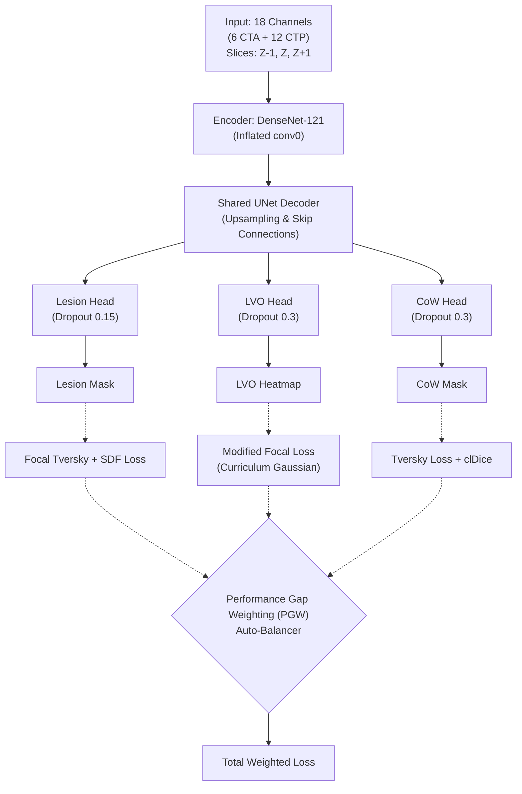

# ISLES'24: Technical Whitepaper - Single-Encoder Multi-Task 2.5D UNet (SOTA Architecture)

Tài liệu này đặc tả toàn bộ kiến trúc mô hình, hệ thống hàm mất mát (Loss) và chiến lược huấn luyện động (Dynamic Training Strategy) dành riêng cho bài toán phân vùng đột quỵ cực kỳ mất cân bằng (ISLES 2024).

---

## 1. Tổng quan Kiến trúc (Architecture Overview)

Kiến trúc hiện tại là **Single-Encoder Multi-Task UNet**. Nhờ việc hợp nhất (fusion) dữ liệu ngay từ đầu vào (Early Fusion), mô hình tiết kiệm VRAM đáng kể (chỉ ~13GB trên card T4) trong khi vẫn học được tương tác chéo giữa giải phẫu (CTA) và tưới máu (CTP).

### 1.1. Backbone (Encoder)
- **Base:** DenseNet-121. Khả năng nối tiếp (dense connection) giúp bảo toàn hoàn hảo các dải gradient mềm mỏng (penumbra) của dữ liệu CTP.
- **Input Inflation:** Lớp `conv0` gốc (3 channels) được nhân bản (variance-preserving replication) để tiếp nhận **18 channels** (6 kênh CTA + 12 kênh CTP từ các lát cắt Z-1, Z, Z+1).
- **Pre-trained:** Trọng số RadImageNet/ImageNet để khởi tạo nhanh các bộ lọc gờ (edge filter).

### 1.2. Shared Decoder & Multi-Task Heads
- **Decoder:** UNet tiêu chuẩn, nhận các Skip-Connections từ Encoder để khôi phục độ phân giải.
- **Heads (3 Nhánh độc lập):**
  - Cấu trúc: `Conv3x3 -> BN -> ReLU -> SpatialDropout2d -> Conv1x1`.
  - **Lesion Head:** Cấu hình **Dropout rất thấp (0.15)** để ngăn chặn việc triệt tiêu ngẫu nhiên các đặc trưng không gian mỏng manh của các ổ nhồi máu siêu nhỏ.
  - **LVO & CoW Head:** Dropout 0.3 (Tiêu chuẩn).

---

## 2. Chiến lược Hàm Mục Tiêu (Task-Specific Losses)

Do tính chất phân mảnh, kích thước cực kỳ đa dạng và tỷ lệ mất cân bằng class khổng lồ (>1:1000 đối với LVO), mỗi nhánh sử dụng một cụm Loss chuyên biệt.

| Task | Công thức Loss | Chức năng (Tại sao sử dụng?) |
| :--- | :--- | :--- |
| **Lesion** (Ổ Nhồi máu) | `Focal Tversky Loss (α=0.3, β=0.7, γ=1.25)`  + `SDF Boundary Loss (0.15)` | **Per-slice compute** (Tính trên từng lát cắt, không gộp batch) để tránh nổ gradient từ Batch-Dice khi dính False Positive. SDF Loss giúp "bo viền" (shape-aware) để bám khít các nếp gấp mô não thay vì loang lổ. `β=0.7` ép mô hình bám bắt các ổ lắt nhắt. |
| **LVO** (Tắc nghẽn mạch lớn) | `Modified Focal Loss (Gaussian Curriculum)`  + `BCEWithLogits(pos_weight=25.0)` | Mạch máu nghẽn (LVO) thường chỉ là 1 chấm vài pixel. **Curriculum Gaussian Blur** phóng to điểm LVO thành vệt sáng to ở các Epoch đầu (σ=7.5) để mô hình dễ "bắt" (Hit), sau đó thu nhỏ dần (σ=2.0) để tinh chỉnh độ sắc nét. |
| **CoW** (Vòng Willis) | `Tversky Loss`  + `clDice (Topology)` | CoW là cấu trúc mạng lưới (xương cá). **clDice (Centerline Dice)** ép mô hình bảo tồn cấu trúc topology liên tục, tránh đứt đoạn mạch máu, trong khi Tversky Loss cung cấp luồng gradient tuyến tính hội tụ rất mượt. |

---

## 3. Cân bằng Đa Nhiệm Động (Performance Gap Weighting - PGW)

Thay vì cộng 3 Loss lại bằng các con số tĩnh (Ví dụ: `1 * Lesion + 1 * LVO + 1 * CoW`) khiến mô hình "Bỏ cuộc" ở task khó và "Overfit" ở task dễ, chúng tôi áp dụng bộ cân bằng tự động **PGW**.

1. **Khai báo Target Metric:** LVO (Recall=0.50), Lesion (Dice=0.85), CoW (Dice=0.90).
2. **Tính Gap:** Cứ mỗi cuối Epoch, hệ thống tính `Gap = Target - Current Val Metric`.
3. **Softmax Allocation:** Các task có `Gap` lớn (đang gặp khó khăn) sẽ được PGW bơm thêm trọng số (Weight). Task nào đã đạt đỉnh (`Gap ≈ 0`), Weight sẽ bị kìm xuống mức tối thiểu (ví dụ: `w_min=0.1`) để không làm nhiễu gradient của các task khác.
4. **Momentum:** Áp dụng Momentum (EMA) để giữ cho trọng số thay đổi từ từ, không bị giật cục giữa các Epoch.

---

## 4. Chiến lược Tối ưu hóa (Optimization Protocol)

- **Unfreeze Curriculum:** Encoder bị **Đóng băng (Frozen)** trong 11 Epoch đầu tiên. Việc này để bộ Decoder (vốn là trọng số random) tự "warm-up" và học cách diễn dịch (translate) các tín hiệu cơ bản mà không làm hỏng trọng số Pre-trained quý giá của Encoder.
- **Differential Learning Rate:** Sau khi Unfreeze, Encoder được cấp LR rất nhỏ (bằng `1/100` so với Decoder) để chỉ Fine-tune nhẹ nhàng.
- **Mixed Precision (AMP):** Huấn luyện với FP16 qua Scaler giúp tối ưu x2 lượng VRAM tiêu thụ.
- **Checkpointing Độc lập:** Hệ thống tự động tách ra lưu 3 file `best_model` khác nhau tương ứng với hiệu năng đỉnh của từng Task, bởi lẽ trong Multi-task Learning, các task thường đạt đỉnh ở các epoch lệch nhau.
